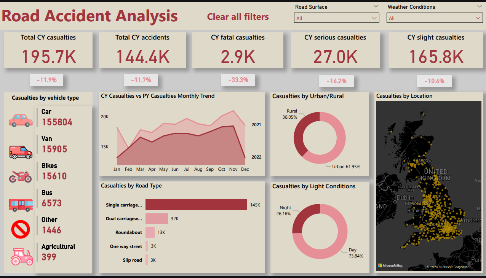

# 🚗 Road Accident Analysis Dashboard | Power BI

This Power BI dashboard analyzes road accident trends and casualty data for the years 2021 and 2022. It provides actionable insights for policymakers, analysts, and urban planners to enhance road safety.

## 📌 Project Objective

To explore patterns in accident severity, vehicle involvement, and location factors, helping identify high-risk areas and suggest infrastructure improvements.

## 📊 Key Metrics & Insights

- **Total Casualties**: 417,883
- **Severity Breakdown**:
  - Fatal: 1.7%
  - Serious: 14.2%
  - Slight: 84.1%
- **Top Contributing Vehicles**: 
  - Cars (79.8%)
  - Followed by motorcycles, trucks, and buses
- **Day vs. Night Patterns**:
  - Urban areas: More daytime accidents
  - Rural areas: Higher night-time fatalities
- **Road Type Analysis**: Shows which types of roads pose higher accident risks

## 🛠 Tools Used

- **Power BI Desktop**
- Power Query (ETL)
- DAX (Calculations and KPIs)
- Excel (Data Source)

## 🖼️ Dashboard Previews

## 📁 Files

- [`road-accident-dashboard.pbix`](Dashboard/Road_Accident_analysis.pbix) — Full Power BI file

## 📌 Notes

- The data used is anonymized and for demonstration only.
- All visuals are interactive and allow deep-dive filtering.

---

## ✍️ Author

**Bharat Kumar**  
[LinkedIn](https://www.linkedin.com/in/bharat-kumar-bh)

---
